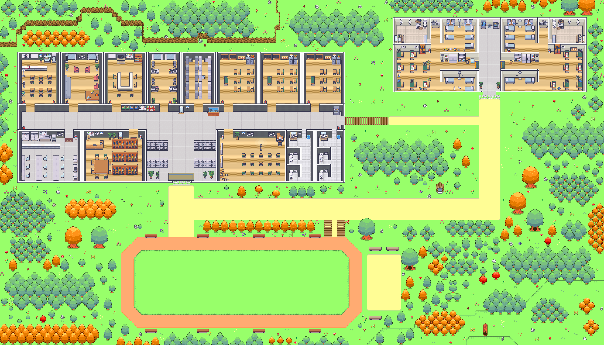

# RPG_Story

<p align="center" width="100%">

</p>

## 프로젝트 개요

정해진 스토리 안에서만 반복되는 MMORPG 서사의 한계를, AI가 큰 스토리의 틀을 벗어나지 않는 선에서 동적으로 스토리를 생성함으로써 개선할 수 있는지 검증하기 위한 시뮬레이션 프로젝트다. '마을 회장 선거'를 배경으로, 플레이어의 선택에 따라 NPC들의 여론이 어떻게 변화하는지를 실험했다.

## 기반 프로젝트

본 프로젝트는 Stanford의 Generative Agents(Park et al., 2023) 오픈소스 코드베이스(reverie)를 기반으로 한다. Memory Stream 구조와 시뮬레이션 백엔드는 원 코드베이스를 그대로 활용했으며, 여기에 맵·조작·실험 시나리오를 직접 구현·수정하여 확장했다.

- 원 저작물: [Generative Agents: Interactive Simulacra of Human Behavior](https://github.com/joonspk-research/generative_agents) (Apache-2.0 License)

## 직접 구현 / 수정한 부분

### 맵 제작 및 수정
- 실험용 신규 타일맵(JSON)을 Tiled로 직접 제작하여 추가했다.
- 타일셋 참조 오류·오타를 수정해 맵 로딩 에러를 해결했다.
- Wall 레이어의 잘못된 타일셋 참조를 수정했다.

### 코드 버그 수정
- 날짜 파싱 포맷 오류를 수정했다 (`%B` → `%b`, meta.json 형식 불일치 해결).
- 시뮬레이션 결과 저장 시 폴더 미존재로 발생하던 오류를 방지하는 코드를 추가했다.

### OpenAI API 마이그레이션
- 2023년 기준으로 작성된 구형 OpenAI API 호출부를 최신 SDK 문법으로 전면 수정했다.
- 지원 종료된 구식 모델을 사용 가능한 모델로 일괄 교체·조정했다.

### 시뮬레이션 구성
- 실험용 시뮬레이션 저장소 및 페르소나(NPC) 데이터를 구성했다.
- '마을 회장 선거' 실험 시나리오를 설계하고 진행했다.

## 기술 스택


## 실험 내용

본 저장소는 개발 과정의 버전이며, 최종 실험에 사용한 구성과는 일부 차이가 있을 수 있다.

## Acknowledgements

Memory Stream 구조와 시뮬레이션 백엔드를 비롯해 이 프로젝트의 근간이 되어준 Generative Agents 원저자 및 원작자분들께 감사드립니다. 이 프로젝트는 해당 오픈소스가 없었다면 시작할 수 없었을 것 입니다.
맵 타일, 가구, 캐릭터 스프라이트 등 비주얼 에셋 역시 Generative Agents 오픈소스에 포함된 리소스를 그대로 재사용 했습니다. 원작자분들께 감사합니다.

- 배경 아트: [PixyMoon (@_PixyMoon_)](https://twitter.com/_PixyMoon_)
- 가구/인테리어 디자인: [LimeZu (@lime_px)](https://twitter.com/lime_px)
- 캐릭터 디자인: [ぴぽ (@pipohi)](https://twitter.com/pipohi)

```bibtex
@inproceedings{Park2023GenerativeAgents,
  author = {Park, Joon Sung and O'Brien, Joseph C. and Cai, Carrie J. and Morris, Meredith Ringel and Liang, Percy and Bernstein, Michael S.},
  title = {Generative Agents: Interactive Simulacra of Human Behavior},
  year = {2023},
  publisher = {Association for Computing Machinery},
  booktitle = {Proceedings of the 36th Annual ACM Symposium on User Interface Software and Technology (UIST '23)},
  series = {UIST '23}
}
```

## License

원본 [generative_agents](https://github.com/joonspk-research/generative_agents) 저장소를 따라 Apache-2.0 라이선스를 적용한다.
